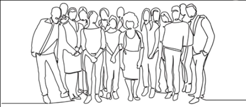

## Algorítmos mais importantes de FUP



## Fila dos estressados

### Descrição do contexto

- Na entrada de um evento de um experimento social, os participantes ganhavam uma pulseira especial que precisavam ficar utilizando.
- A pulseira informava, num pequeno visor, um número inteiro que representava o nível de stress daquele participante.
- Nenhum participante sabia o que aquele número significava.
- O número 1 significava totalmente tranquilo e ia aumentando conforme o stress do participante aumentava a´té o valor máximo de 99.
- Para fazer uma representação lógica, os números positivos representam homens e os números negativos representam mulheres em um vetor de inteiros.
- Precisamos escrever os algorítmos que identifiquem informações importantes sobre os participantes da fila.

**Exemplos:** 
- `[]` equivale a uma fila vazia.
- `[-1, -50, -99]` equivale a uma mulher totalmente tranquila, uma mulher médio estressada e uma mulher extremamente estressada.
- `[80, 70, 90, -4]` equivale a três homens estressados e uma mulher tranquila. 
---

### Exercícios

#### **Busca**
- **existe**: Alguém com o valor X está na fila?
- **contar**: Quantas vezes o valor X apareceu na fila?
- **procurar_valor**: Em que posição da fila aparece X pela primeira vez?
- **procurar_valor_apos**: Dada a posição para iniciar a busca, qual a próxima posição em que aparece X?

#### **Melhor caso**
- **procurar_menor**: qual o menor valor da lista?
    - **procurar_maior**: qual o maior valor da lista?
- **procurar_menor_pos**: qual a posição do menor valor da lista?
    - **procurar_menor_pos_apos**: qual a posição do menor valor da lista depois da posição P?
- **procurar_melhor_se**: qual a posição do HOMEM mais calmo? (menor valor maior que 0)


#### **Contagem**
- **calcular_stress_medio**: qual a média de stress da fila? (abs)
- **mais_homens_ou_mulheres**: Na fila existem mais homens ou mulheres?
- **qual_metade_eh_mais_estressada**: O nível de stress somado de todas as pessoas da primeira metade é maior que o nível de stress somado das pessoas da segunda metade da fila? (abs)
- **homens_sao_mais_estressados_que_mulheres**: a média do stress dos homens é maior que a das mulheres? 

#### **Filter - Operações de Filtragem**
- Retornando vetores dentro de uma função em C, C++, Javascript, Python
- **clonar**
- **filtrar_por_criterio**
    - **pegar_homens**: retorne uma lista com os homens (valores positivos)
    - **pegar_calmos**: retorne uma lista com as pessoas com stress menor que 10 (positivos menor que 10) (abs)
    - **pegar_mulheres_calmas**: retorne uma lista com as mulheres com nível de stress menor que 10.(negativos menor que 10)

#### **Acesso**
- **inverter_com_copia**
- **reverter_inplace**
- **sortear**
- **embaralhar**
- **ordenar** - selection sort utilizando procurar_menor_pos_apos

#### **Conjuntos**
- **exclusivos**: O fiscal permitiu a entrada de um único representante de cada valor, ou seja, uma lista dos valores que aparecem na fila sem repetição. Que conjunto foi formado?
    - ```[1, 3, 4, 3, -1, -2, -2] -> [1, 3, 4, -1, -3]```
    - **diferentes**: Qual a lista dos diferentes níveis de stress que aparecem?
        - ```[1, 3, 4, 3, -1, -2, -2] -> [1, 3, 4]```

- **abandonados**: quais pessoas ficaram na fila após remover um exemplar de cada valor?
    - ```[1, 3, 4, 3, -1, -2, -2] -> [3, -2]```

#### **Map - Manipulação** -> map, zip, filter
- **sozinhos**: Quais PESSOAS eram as únicas representantes do seu nível de stress na fila? (abs)
    - ```[1, 3, 4, 3, -1, -3, -3] -> [4]```
- **mais_ocorrencias**: Qual a maior quantidade de ocorrências do mesmo nível de stress. (abs)
    - ```[1, 3, 4, 5, -1, -5, -5] -> 3```
- **mais_recorrentes**: Quais os níveis de stress mais recorrentes. (abs)
    - ```[1, 3, 4, 5, -1, -5, -5, 3, -3] -> [5, 3]```

#### **Proximidade**
- **briga** Quando alguém super estressado(>50) está ao lado de duas pessoas muito estressadas(>30) pode dar briga. Quantas vezes essa situação acontece?
- **apaziguado** Se alguém hiper estressado(>80) estiver ao lado de pelo menos uma pessoa bem tranquila (<10) ela vai ser apaziguada. Em que posições estão esses que serão apaziguados?


### **Sequências**
- **quantos_times** Duas ou mais pessoas do mesmo sexo seguidas podem formar um time. Quantos times existem na fila?
- **maior_time** Qual o maior time que apareceu na fila?
- **sozinhos** Quantas pessoas não estavam em um time?

#### **Grupos**
- **casais**: Casais são formados quando quando um homem e uma mulher com o mesmo nível de stress são formados. O 3 e o -3 formam um casal. Os participantes fossem orientados a sair da fila e procurar seu par. Quantos casais poderiam ser formados?
- **trios**: Pedimos pros participantes se organizassem em trios. Todos os 3 deveriam estar com o mesmo nível de stress.Quantos trios podem ser formados?

#### **Alteração**
- **remove**: Dado a pessoa X, como fica a fila após remover X?
- **insert**: Como fica a fila se eu inserir a pessoa X na posição Y.
- **dance**: O coordenador disse: se você está do lado de alguém da com o mesmo nível de stress que você, saia da fila com ele. Quando os pares saiam, as vezes se formavam novos pares que também saíam. Quem ficou na fila?

